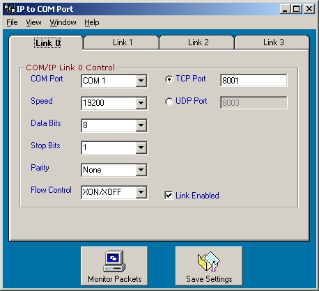



## IP to Serial port Pass\-Through Server

### Description

IP to Serial port Pass-Through Server

Update 22-MAR-2005

This project takes TCP and UDP messages from other applications

and routes them to the proper serial port to control serial

devices (ex. Telephone systems, IP Routers console port etc.)

or other device on a PC COM Port from a remote site.

Communication can be one way (App --> COM Port) via UDP packets, or

Communication can be two way (App <-> COM Port) via a TCP connection.

App can support up to four connections to four serial ports. App also starts in the SysTray so it's out of the way and a double click brings it onto the desk top. App has a monitor feature, look at the packets in Raw Text, Verbose Text and HEX values.

TCP connections release the serial port when there is no connection

In UDP mode, serial port is always active.

Application has been tested on Win2000 Pro and XP Pro.

Serial applications tested have been …

Connection to Comdial Telephone Systems (DXP, DPX Plus, FXS, FXT, FXII)

using the programming software (VMMI).

Unix box via a Procomm Plus Telnet connection with terminal negotiate off.

Kenwood TS870 Amateur Radio serial control

Netopia 5000 router console port using Procomm Plus as above.

Comments welcome
 
### More Info
 

             |
---                |---
**Submitted On**   |2005-03-22 15:08:42
**By**             |[Mark Mokoski](https://github.com/Planet-Source-Code/PSCIndex/blob/master/ByAuthor/mark-mokoski.md)
**Level**          |Intermediate
**User Rating**    |4.8 (163 globes from 34 users)
**Compatibility**  |VB 5\.0, VB 6\.0
**Category**       |[Complete Applications](https://github.com/Planet-Source-Code/PSCIndex/blob/master/ByCategory/complete-applications__1-27.md)
**World**          |[Visual Basic](https://github.com/Planet-Source-Code/PSCIndex/blob/master/ByWorld/visual-basic.md)
**Archive File**   |[IP\_to\_Seri1866733222005\.zip](https://github.com/Planet-Source-Code/mark-mokoski-ip-to-serial-port-pass-through-server__1-43963/archive/master.zip)

